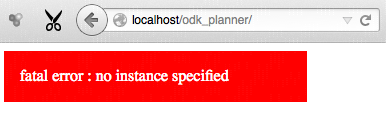

.. _installing:

Installation
============

This part of the documentation describes how ``odk_planner`` can be installed
on the server.  If you use the program from a place where it has already be
installed and you got a working URL that asks you for username/password, then
you can proceed with the :ref:`Configuration <configuring>`.

.. _install-prerequisites:

Prerequisites
-------------

  - A working `ODK Aggregate`_ (tested against v1.3.2) installation.
    ``odk_planner`` can be installed on the same computer that runs ODK
    Aggregate, or on a different computer that can connect to the MySQL server
    that is used by ODK Aggregate.

  - Web server (tested with Apache_) and PHP_

  - Python2_ : Python scripts are used to :ref:`create new instances
    <install-instance>` and for :ref:`automated testing <testing>`

  - Python3_ : :ref:`ODK pusher <odk-pusher>` can be used to automatically
    push data to the ODK Aggregate server and is built with Python3

Please see the following documents on how to install these prerequisites on
your local computer:

  - On windows, install MySQL_, Apache_ and PHP_ bundled in one simple download:
    XAMPP_

  - On Linux make sure you installed the packages ``apache2``, ``mysql-server``,
    and ``php5``

  - On OS X you should first install Brew_ and then download the package
    ``mysql`` -- apache/php are installed by default, but `must be
    activated`_

  - Once you got these up and running you can continue with the detailed
    description on `how to install ODK Aggregate`_

.. note:: XAMPP also comes with a pre-installed Tomcat-version that is not
  compatible with ODK Aggregate. Thus, you need to install the appropriate Tomcat
  version (Tomcat 6) separately (see `how to install ODK Aggregate`_)

.. _ODK Aggregate: https://opendatakit.org/use/aggregate/
.. _Apache: http://httpd.apache.org/
.. _PHP: http://php.net/
.. _MySQL: https://www.mysql.com/
.. _XAMPP: https://www.apachefriends.org/index.html
.. _Brew: http://brew.sh/
.. _must be activated: https://duckduckgo.com/?q=OS+X+activate+apache+php
.. _how to install ODK Aggregate: https://opendatakit.org/use/aggregate/tomcat-install/
.. _Python2: https://www.python.org/downloads/release/python-278/
.. _Python3: https://www.python.org/downloads/release/python-342/

.. _install-copy:

Copy odk_planner
----------------

Once apache is up & running, move the entire ``odk_planner`` directory structure
into its documents root folder

  - on OS X this is ``/Library/WebServer/Documents/``
  - on Debian this is ``/var/www/``
  - when using XAMPP on Windows this is ``C:\xampp\xampp\htdocs``

When you now open ``http://localhost/odk_planner`` in your web browser you
should see the following

On Linux/Unix/OS X it is important to configure the **file access rights**
correctly so that the user running apache can modify the per-instance files
(it's enough to set the correct group; write permissions will be set by the
script ``create_instance.py``):

.. code-block:: bash

  cd /path/to/odk_planner
  sudo chown :_www instances/ # on OS X
  sudo chown :www-data instances/ # on Debian

.. _install-instance:

Setup instance
--------------

Next thing to do is to set up an instance. ``odk_planner`` saves all its
configuration, forms, and log data on a per-instance basis.  With a single
download of ``odk_planner`` you can set up any number of instances that are
completely independent of each other.

A new instance is then created by executing the script
``tools/create_instance.py`` (to change the proposed default values please
modify the file ``test/demo/config/config-sample.ini``)::

  $ python tools/create_instance.py

  this script will create a new odk_planner instance
  --------------------------------------------------

  instance name: test
  MySQL username: ["odk_planner_ro"] aggregate_user
  MySQL password: ["0dk pa2sw0rd"] lnb83oSL%.ni
  MySQL database: ["odk_planner_test"] main_study
  MySQL host: ["127.0.0.1"]

  generated new instance:

    - name: test
    - temporary password: xL6NZQfL

  make sure that the directory "instances/test/" and all its
  contents are writable by the apache user (this should automatically be the
  case if the directory "instances/" has the right group
  ownership)

  press <ENTER> to continue...

The script asks for an instance name (below referenced as ``instance_name``)
and MySQL connection parameters.  After creating the instance, the temporary
password (``xL6NZQfL`` in the example above) is printed.  This password can be
used for an initial login, before :ref:`new passwords <user-sheet>` are set and
will be deactivated after the config is changed via the webinterface for
a first time.

This part of the configuration is never shown to the user of the webapp and can
only be modified by editing the textfile
``instances/<instance_name>/config/config.ini``; the following values can be
specified

  - ``login_timeout`` : after how many minutes a user should be automatically
    logged out in absence of activity

  - ``proxy`` : optional setting if a proxy server has to be used to access
    other websites (used for :ref:`sending SMS <sending-sms>`)

  - MySQL settings : ``db_host``, ``db_database``, ``db_user``, ``db_pass``
    : the credentials with which ``odk_planner`` will access the MySQL
    database.  See the file ``create_db_and_user.sql`` that was created during
    ODK Aggregate installtion (or :ref:`get them from the webapp
    <aggregate-db>`).  Note that ``odk_planner`` only needs read rights and
    a new user without write access should be created.

  - email settings : ``smtp_server``, ``smtp_user``, ``smtp_pass`` : reports
    are sent via email when :ref:`automatization <automatization>` is used;
    these settings specify a valid email account from which the email can be
    sent (the server running the webapp does not need to be configured to send
    emails; being able to connect any SMTP server is enough)

  - default settings for new instances can be changed by editing the file
    ``test/demo/config/config-sample.ini``

The initial configuration is the same that is used in the :ref:`tutorial
<tutorial>`, but this can also be changed by modifying the file
``test/demo/config/config-sample.xls``

.. _installing-cron:

Installing cron job
-------------------

The script ``cron.php`` (see :ref:`automatization <automatization>`) should
be called on a daily basis.  To install cronjob_ that executes the script
once a day, execute the following command (as root):

.. code-block:: sh

  crontab -u www-data -e

Then add a new line at the end of the file for every instance that you want
to :ref:`automatize <automatization>` (the following example will run the
cron script once a day at 5 AM)::

  0 5 * * * /usr/bin/php /path/to/odk_planner/cron.php -i instance_name

Confirm that

  1. you use the same user that runs the PHP script when called from the
     web server (i.e. the ``www-data`` in the example above)
  2. you specify the right path to ``odk_planner``
  3. the user specified above actually is permitted to run cron jobs
  4. that no error output is generated (check the local email of the user
     running the cron job)

.. _cronjob: http://en.wikipedia.org/wiki/Cron

