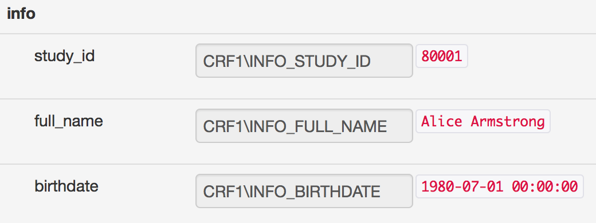

.. _tutorial:

Tutorial
========

The following example illustrates most of ``odk_planner``'s features and should
be a good starting point to implement your own project.  The tutorial is
designed in such a way that it can be followed step by step and all files are
provided for download.  The same data is also used for :ref:`automated testing
<testing>`, which is essentially an automated copy of the tutorial outlined
in this chapter.

Demo Project Description
------------------------

The forms used in the demo project are deliberatly kept as simple as possible,
while illustrating most of ``odk_planner``'s features.  The demo study
"Tuberculosis_ Cohort" collects data from tuberculosis *patients* that present
at a health facility, as well as from a group of *controls* that are not
infected with tuberculosis.

The demo project consists of five different forms.  All forms are generated
using `XLSForm <http://xlsform.org>`_.

  - ``CRF1`` : This is the eligibility form that records patient details and
    confirms the study's inclusion criteria.

  - ``CRF1C`` : The eligibility form for controls, which is different from the
    eligibility form for patients.

  - ``CRF2`` : This clinical request form is filled at the same day as the
    eligibility form and assesses some clinical signs and symptoms.  The same
    form applies for patients and controls.

  - ``LRF1`` : Although a lab sample is taken at the patient's first visit to
    the health facility, the lab form is only expected to be entered into the
    database after some days necessary to perform all the analysis.  Again,
    the same form applies for patients as well as controls.

  - ``CRFX`` : If patients have a negative lab result, they are expected to
    get an X-ray in the following week to complete the diagnostic information.

All patients receive a unique ``study_id`` that is used to connect the
different forms of the same patient.  The same applies for the controls, but
both groups can be differentiate by looking at their ID : patients have
a number like ``80XXX`` and controls have a number like ``83XXX``.  The
laboratory adds a suffix ``-V01`` to this ID so it is possible to commit
multiple laboratory forms that for the same patient, while still having
a unique identifier for every form.

.. _Tuberculosis: https://en.wikipedia.org/wiki/Tuberculosis

.. _demo-files:

Demo Project Files
~~~~~~~~~~~~~~~~~~

All files necessary to follow this tutorial can be :download:`downloaded
<_static/tutorial/demo.zip>`.  The following files are included

  - ``demo/config/`` : contains configuration files; these files are also
    copied when a :ref:`new instance is setup <install-instance>` and for
    :ref:`testing <testing>`.

  - ``demo/forms/`` : contains all the forms (see below), in Excel format
    as well as compiled XForms (in subdirectory ``out/``).

  - ``demo/data/`` : some sample data to populate the ODK Aggregate database,
    including a script ``push.py`` that automatically uploads the data to
    a server

.. _demo-init:

Initial setup of ``odk_planner`` and ODK Aggregate
--------------------------------------------------

**First step**: Make sure you (or someone else) correctly installed
``odk_planner`` as described in the :ref:`chapter on installation
<installing>`.  To proceed with the tutorial you need to be able to access the
login screen:

.. image:: _static/imgs/screenshots/login.png
  :align: center
  :width: 564

In the following we will always use
``http://localhost/odk_planner/?instance=test`` as our base address.  Change
the URL accordingly to your setting.

**Second step**: You also need access to the `ODK Aggregate`_ so you can upload
the ``.xml`` forms for the demo project.  You can find these forms in the
``demo/forms/out`` subdirectory of the :ref:`files from the demo project
<demo-files>`.

..

.. image:: _static/imgs/screenshots/forms-aggregate.png
  :align: center
  :width: 642

**Third step**: The demo project files also contain some prepared data ready
for upload.  The data is contained in the files ``demo/data/*.csv``.  You can
either open this data in your favourite spreadsheet program and then use `ODK
Collect`_ to upload row by row by filling out the forms, or you can simply
start the program ``demo/data/push.py`` (needs Python3_) to upload all the data
automatically.

::

  $ python3 demo/data/push.py
  upload data from csv files to Aggregate server? (yn) y
  Aggregate server url [http://localhost:8080/ODKAggregate]
  username []
  password []
  successfully posted form CRF1, "80001"
  successfully posted form CRF1, "80002"
  successfully posted form CRF1, "80003"
  successfully posted form CRF1, "80004"
  successfully posted form CRF1, "80005"
  successfully posted form CRF1, "80006"
  successfully posted form CRF1C, "83001"
  successfully posted form CRF1C, "83002"
  successfully posted form CRF1C, "83003"
  successfully posted form CRF1C, "83004"
  successfully posted form CRF2, "80001"
  successfully posted form CRF2, "80002"
  successfully posted form CRF2, "80003"
  successfully posted form CRF2, "80004"
  successfully posted form CRF2, "80005"
  successfully posted form CRF2, "83001"
  successfully posted form CRF2, "83002"
  successfully posted form CRF2, "83003"
  successfully posted form CRF2, "83004"
  successfully posted form CRFX, "80001"
  successfully posted form CRFX, "80002"
  successfully posted form CRFX, "80003"
  successfully posted form CRFX, "80004"
  successfully posted form CRFX, "80005"
  successfully posted form CRFX, "80006"
  successfully posted form LRF1, "80001-V01"
  successfully posted form LRF1, "80002-V01"
  successfully posted form LRF1, "80003-V01"
  successfully posted form LRF1, "80004-V01"
  successfully posted form LRF1, "80005-V01"
  successfully posted form LRF1, "80006-V01"
  successfully posted form LRF1, "83001-V01"
  successfully posted form LRF1, "83002-V01"
  successfully posted form LRF1, "83003-V01"

.. _ODK Aggregate: https://opendatakit.org/use/aggregate/
.. _ODK Collect: https://opendatakit.org/use/collect/
.. _Python3: https://www.python.org/downloads/release/python-342/

.. _demo-setup:

Setting up the Project
----------------------

Download the :ref:`files from the demo project <demo-files>` and unpack them.
Now go to ``http://localhost/odk_planner/?instance=test`` and use the username
``admin`` and the temporary password from the :ref:`instance creation
<install-instance>`.

First thing we will do now is to upload the config file from the demo project
files ``demo/config/config-sample.xls``.  Open this file with Excel_ (or
LibreOffice_) and go to the :ref:`"users" sheet <user-sheet>`. You will see the
following three users pre-defined:

============ =============== ================================= ==================
name         password        rights                            access
============ =============== ================================= ==================
admin                        overview, data, forms, sms, admin default, sensitive
secretary                    sms, overview, data               default
fieldofficer                 overview, data                    fieldofficer
============ =============== ================================= ==================

Enter three :ref:`good passwords <good-password>` for the three different
users, click on the **admin** link in the top navigation and upload the 
``demo/config/config-sample.xls`` file.

After having uploaded the config file for the first time, the temporary password
will not work anymore, but you can now login using the passwords you defined
in the ``config.xls``.  You can read more about the :ref:`user configuration
settings <user-sheet>`, in particular about the ``rights`` and the ``access``
column.

.. _Excel: http://office.microsoft.com/en-us/excel/
.. _LibreOffice: http://www.libreoffice.org/download/libreoffice-fresh/

.. _demo-forms:

Uploading the forms
-------------------

Once logged in, you should see error messages complaining that "forms are not
found" (in the database) and ``.xls`` forms not uploaded.  So go to the
"forms" tab and upload the forms from the demo project (in the ``demo/forms``
directory).  After uploading the five forms, you should see something like

.. image:: _static/imgs/screenshots/demo_forms.png
  :align: center
  :width: 590

If you see an error saying ``not matched`` this is because you forgot to
:ref:`upload the forms to ODK Aggregate <demo-init>`.

.. _demo-overview:

Check out the overview
----------------------

You can now see the overview in all its beauty

.. image:: _static/imgs/screenshots/demo_overview.png
  :align: center
  :width: 375

The overview highlights the following (hover over a highlighted cell to get
a popover that explains why the cell is colored)

  - case ``80006`` is missing ``CRF2`` and this field is highlighted in red
    because ``CRF1`` was already submitted more than one week ago

  - case ``80006`` has a red bar where its ``LRF1`` is, because the sputum
    smear is negative; and control ``83002`` has a red bar where its ``LRF1``
    is, because the sputum smear is positive -- we'll go into this problem in
    a minute

For an **exercise**, try to download, modify, and upload the ``config.xls`` in
a way to achieve a bold font for all cases/controls with fever (:ref:`solution
<bold-font-fever-cases>`).  To solve this exercise, read more about
:ref:`coloring the overview <colors-sheet>`.

.. _demo-view:

Viewing data
------------

When you now click on a the link ``1/1/14`` to view the ``CRF1`` from case
``80001`` you should see the following

At this point you could -- and should -- be somewhat :ref:`worried <privacy>`
that patient details, such as name and birthdate can be seen on the web...

Luckily, ``odk_planner`` lets you control exactly which user can see which
data.  On one hand, you can defined arbitrary **access groups** for the
different users (:ref:`above <demo-setup>` we have defined the groups
``default``, ``sensitive``, and ``fieldofficer``).  On the other hand, you can
specify for every datapoint which group(s) are permitted to see that data.

Let's first have a look at form ``demo/forms/CRF1.xls``:

=========== ============= =========== ============= =========== ========================
type        name                      access                    label
=========== ============= =========== ============= =========== ========================
begin group info          begin group               begin group Patient Information
text        study_id      text                      text        Study ID number
text        full_name     text        **sensitive** text        Full name
date        birthdate     date        **sensitive** date        Date of birth
text        phone_number1 text        **sensitive** text        Primary phone number
text        phone_number2 text        **sensitive** text        Alternative phone number
=========== ============= =========== ============= =========== ========================

As you can see, this form already defines the datapoints ``full_name``,
``birthdate``, ``phone_number1`` and ``phone_number2`` as **sensitive**.  This
means that only users with the access group ``sensitive`` are allowed to see
this data.  To confirm that this indeed works, first have a look at the data when
you're logged in as ``admin``, then logout and login as ``secretary``.  You should
now see that the corresponding values are masked:

.. image:: _static/imgs/screenshots/demo_data_secretary.png
  :align: center
  :width: 348

All values that have no ``access`` defined automatically get the access group
``default``.  This means that an user like the ``fieldofficer`` who is not part
of the ``default`` access group can only see the datapoints that are
specifically permitted by adding his access group to the access column.  When
you log in with the ``fieldofficer`` account you should see all datapoints
masked:

.. image:: _static/imgs/screenshots/demo_data_fieldofficer.png
  :align: center
  :width: 348

This is a good moment to :ref:`read more about privacy <privacy>`.

**Exercise**: make the first phone number accessible to the field officer. Make
sure that the ``admin`` is still able to see the phone number, but not the
``secretary`` (:ref:`solution <fieldofficer-access>`).

.. _demo-solutions:

Solutions
---------

.. _bold-font-fever-cases:

Bold font for fever cases
~~~~~~~~~~~~~~~~~~~~~~~~~

Modify the :ref:`colors sheet <colors-sheet>` like this

===== ===== ===== =========================== ================
form2 form1 delay condition                   style
===== ===== ===== =========================== ================
LRF1              CRF2\SIGNS_TEMPERATURE>37.5 font-weight:bold
===== ===== ===== =========================== ================

.. _fieldofficer-access:

Field officer phone number access
~~~~~~~~~~~~~~~~~~~~~~~~~~~~~~~~~

Modify (and upload) the file ``demo/forms/CRF1.xls`` and ``demo/forms/CRF1C.xls``
as follows:

=========== ============= =========== ==========================
type        name                      access
=========== ============= =========== ==========================
begin group info          begin group              
text        study_id      text                     
text        full_name     text        sensitive    
date        birthdate     date        sensitive    
text        phone_number1 text        **sensitive,fieldofficer**
text        phone_number2 text        sensitive    
=========== ============= =========== ==========================

