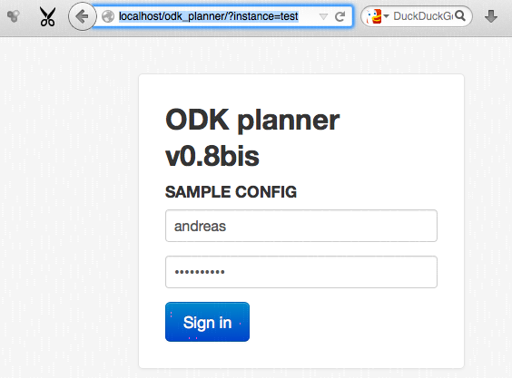

.. _using:

Using
=====

After :ref:`setting up an instance <install-instance>` (or having your sysadmin
doing this for you) you can now log into the webapp using the temporary
password.  Simply add ``?instance=XXX`` to the url where ``odk_planner`` is
located

If you're new to using ``odk_planner`` please proceed with the :ref:`tutorial
<tutorial>` that describes how setup a working configuration.

.. _uploading-form-template:

Uploading form template
-----------------------

The very same Excel sheets that are used as input to `XLSForm
<http://opendatakit.org/use/xlsform/>`_ also serve to describe the content of
the databases to the ``odk_planner``. The grouping used in the spreadsheet is
replicated when content of individual forms is displayed.  Note that the xls
forms must have the **same filename** as the ones that were used to generate
the xml files (which is not necessarily the same as the ``form_id`` in the
settings sheet of the xls form).

A simple access control system is provided by using an **additional column**
``access`` in the excel form: If this column is not existing or empty, the
string ``default`` is assumed to be its content.  Whenever a user views a form,
a field is only displayed if the user's ``acl`` configuration parameter
contains at least one of the comma-separated names that are listed in the
``access`` column. Group names can be freely defined apart from the predefined
name ``default`` -- the :ref:`following example <access-example>` chose the
group names ``sensitive`` and ``secretary``.  If a field has the special access
group ``sms``, then its value can be sent via :ref:`short messages
<config-sms>`.

Forms can be managed by any :ref:`user having the "forms" <user-sheet>` right.
The form overview page is displayed by navigating through the **forms** menu
item on top of the page. This page shows an overview of all uploaded forms in
a table.

If there was a problem in the matching between database columns and form
``.xls`` fields, it is displayed in the "info" column of this overview table.
A ``not matched`` indicates that the corresponding form could not be matched
with any form in the database -- make sure the ``.xml`` form was uploaded to
the aggregate server.

This view also allows to **delete** forms and **upload** new ones. Make sure
your spreadsheet has the extension ``.xls`` and is in Microsoft Excel
97/2000/XP/2003 format.

.. _access-example:

Example of access restrictions
~~~~~~~~~~~~~~~~~~~~~~~~~~~~~~

========================  =======================  ===========
``access`` column         user's ``acl``           result
========================  =======================  ===========
(empty or missing)         ``default``             can view
``sensitive``              ``default``             can't view
``sensitive, default``     ``default``             can view
``sensitive, secretary``   ``default, sensitive``  can view
========================  =======================  ===========

.. _overview-table:

Overview entered forms
----------------------

The main purpose of ``odk_planner`` is to shows an overview of all entered
forms (as far as their corresponding ``.xls`` form has been uploaded) so far in
a structured way. The different forms are linked together using a special field
``$idfield`` that must be present in every individual form.  The overview table
view displays all forms submitted so far, with all forms having the same
``$idfield`` arranged in a row. For every form the submission date is
displayed. It is possible to have more than one submission of the same form for
the same ``$idfield`` -- this would be displayed with two different submission
date/times.

The :ref:`"colors" sheet <colors-sheet>` in ``config.xls`` specifies the temporal
interdependance of the different forms. Normally, a follow-up form is expected
to be submitted after a given delay. If the time period between two forms is
longer than specified (or if the follow-up form has not been submitted yet and
the current date is alreday considered "late"), the corresponding field in the
overview table is highlighted.

The data of individual submissions can be viewed by clicking on the submission
date/time (user needs ``data`` right).

.. _csv-generation:

``.csv`` generation
~~~~~~~~~~~~~~~~~~~

In the upper left corner of every overview table there is a button that will
generate a ``.csv`` list of missing forms. Whether a highlighted cell should be
included in this list is :ref:`specified by the value of its "list" column
<colors-sheet-additional>`.  These same lists are also generated and attached
to emails when the script is :ref:`run autonomously <automatization>`.

.. _viewing-data:

Viewing data
------------

After selecting a submission for display by clicking on it in the overview
table, its contents are arranged following the structure of the corresponding
uploaded ``.xls`` form. Individual form fields can be selectively ``(masked)``
from users by using a ``access`` column in the ``.xls`` form.  :ref:`See above
<access-example>` for more on access restrictions.

.. _sending-sms:

Sending SMS
-----------

If participants save their phone number in a form, this information can be used
to send short messages.  Refer to :ref:`config-sms` for proper configuration.

Messages can be sent manually:  Click on the small letter symbol next to the
participant ID in the :ref:`overview table <overview-table>` to get to a
message screen.  The phone number can be choosen from a drop down and the message
can be either a pre-defined template or a free text.

.. _autogenerating-messages:

Autogenerating messages
~~~~~~~~~~~~~~~~~~~~~~~

This SMS feature can also be used in a semi-autonomous fashion.  The same rules
that are used to :ref:`color the overview table <colors-sheet>` can also be
used to auto-generate messages from templates.  A small widget on top of every
overview table indicates how many messages are generated as a result of these
rules (also showing the number of automatically generated messages already
sent).

.. _automatization:

Automatization
--------------

The PHP file called ``cron.php`` can be executed on the server and will
generate an overview. Different components of the ``odk_planner`` can register
to use this overview to generate output. Log messages are added to the
:ref:`log file <log-files>` ``cron``. At every script invocation, an
email is sent to the :ref:`notify email address <config-cron>`.

Currently, the following actions can be performed autonomously

  - Automatically sending :ref:`autogenerated messages
    <Autogenerating-messages>` to participants (if ``!`` is added to the
    template name in the :ref:`additional configuration
    <colors-sheet-additional>`).

  - Creating :ref:`lists of missing forms <csv-generation>` and attaching them
    to the email (on the days specified in the :ref:`cron configuration
    <config-cron>`).

.. _log-files:

Log files
---------

The directory ``log/`` contains different log files that can be examined through
the web interface (in the ``admin`` page). Additionally, an update on any of
these logs can be sent to the the :ref:`notify email address <config-cron>`.

  - ``user`` : logins and login attempts
  - ``cron`` : log of actions that were performed autonomously
  - ``sms`` : list of SMS that were sent
  - ``mass-sms`` : list of patient ID / template title of short message

